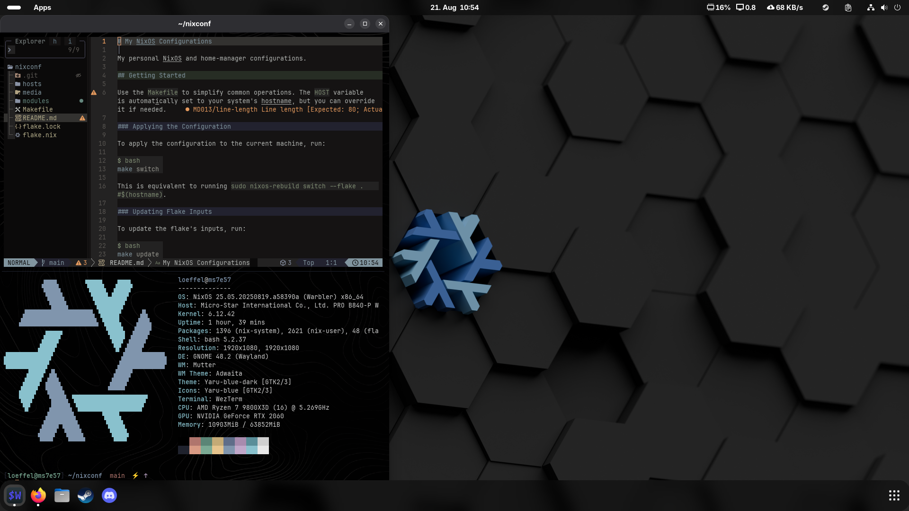

# My NixOS Configurations

My personal Nix configurations.
For MacOS, NixOS and WSL.



## Getting Started

Use the `justfile` to simplify common operations. The `HOST` variable is automatically set to your system's hostname.

Run `just --list` to see all available recipes.

### Applying the Configuration

#### NixOS or MacOS

The `switch` recipe automatically detects your OS:

```sh
just switch
```

#### WSL

You can build your own WSL file.
You need an existing Nix installation.

Run to build the WSL Image:

```sh
just build-wsl
```

Your build file is under dist/nixos.wsl

For an existing NixOS WSL installation:

```sh
just switch
```

### Updating Flake Inputs

To update the flake's inputs, run:

```sh
just update
```

### Other Useful Commands

- `just build`: Build the configuration without switching
- `just test`: Test the configuration (temporary activation)
- `just dump-hardware-config`: Generate hardware configuration for current host
