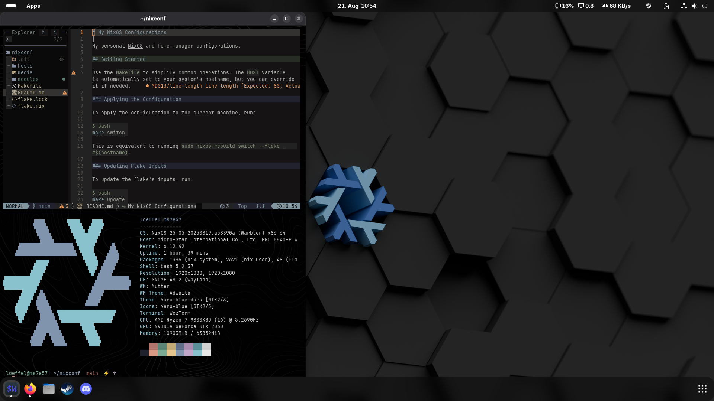

# My NixOS Configurations

My personal Nix configurations.
For MacOS, NixOS and WSL.



## Getting Started

Use the `justfile` to simplify common operations. The `HOST` variable is automatically set to your system's hostname.

Run `just --list` to see all available recipes.

### Applying the Configuration

#### NixOS or MacOS

The `switch` recipe automatically detects your OS:

```sh
just switch
```

#### WSL

You can build your own WSL file.
You need an existing Nix installation.

Run to build the WSL Image:

```sh
just build-wsl
```

Your build file is under dist/nixos.wsl

For an existing NixOS WSL installation:

```sh
just switch
```

### Updating Flake Inputs

To update the flake's inputs, run:

```sh
just update
```

### Secrets With Home Manager

`sops-nix` is available in the Home Manager layer.

Put encrypted files under `secrets/` and define them in a Home Manager module with `sops.secrets`.

Example:

```nix
{
  sops.defaultSopsFile = ../../../secrets/home.yaml;

  sops.secrets."git-credentials" = {
    path = "${config.home.homeDirectory}/.config/git/credentials";
  };
}
```

The default Age key path is `~/.config/sops/age/keys.txt`.
See `secrets/README.md` for the expected layout and commands.

### Other Useful Commands

- `just build`: Build the configuration without switching
- `just test`: Test the configuration (temporary activation)
- `just dump-hardware-config`: Generate hardware configuration for current host
